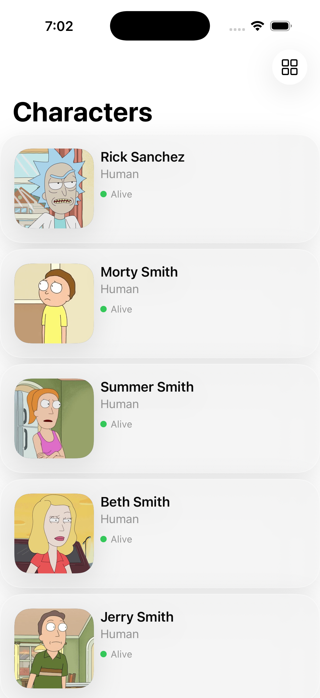
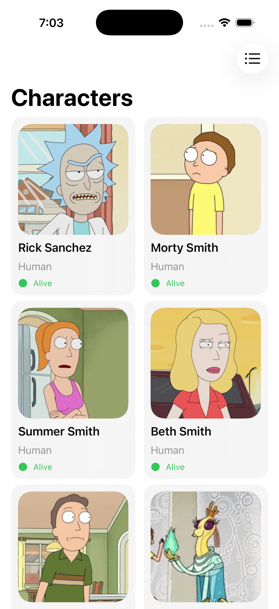
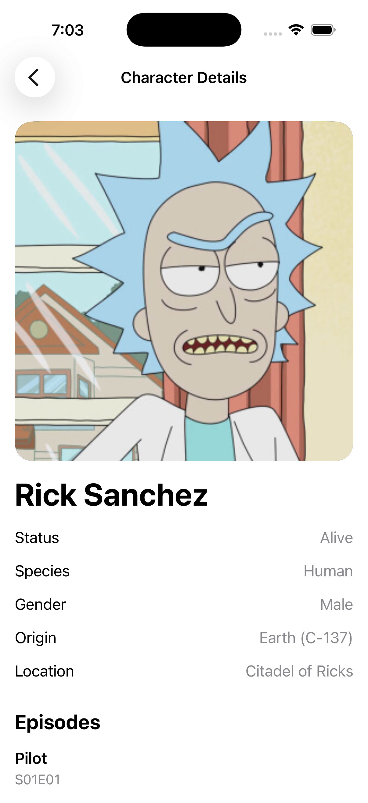

# Rick and Morty GraphQL iOS App

A SwiftUI demo application that uses Apollo iOS and the public Rick and Morty GraphQL API.

The project demonstrates type-safe GraphQL networking, pagination, MVVM architecture, dependency injection, domain-model mapping, navigation, and unit testing.

## Features

* Character list from a GraphQL API
* Infinite page-based pagination
* List and adaptive grid layouts
* Persisted layout preference
* Character details screen
* Loading, retry, and error states
* Type-safe Apollo-generated query models
* Apollo-to-domain model mapping
* Async/await networking
* Dependency injection
* View-model unit tests
* SwiftLint and SwiftFormat configuration

## Screenshots

| List                                              | Grid                                              | Details                                                 |
| ------------------------------------------------- | ------------------------------------------------- | ------------------------------------------------------- |
|  |  |  |

## Tech Stack

* Swift
* SwiftUI
* Apollo iOS
* GraphQL
* Swift Concurrency
* Swift Testing
* Swift Package Manager
* SwiftLint
* SwiftFormat

## Architecture

The project uses MVVM with a repository abstraction and dependency injection.

```text
SwiftUI View
     ↓
ViewModel
     ↓
CharactersRepository
     ↓
ApolloCharactersRepository
     ↓
Apollo Client
     ↓
Rick and Morty GraphQL API
```

### Repository

`CharactersRepository` defines the data operations required by the application:

```swift
protocol CharactersRepository: Sendable {
    func fetchCharacters(page: Int) async throws -> CharactersPage
    func fetchCharacter(id: String) async throws -> CharacterDetails
}
```

`ApolloCharactersRepository` executes generated Apollo queries and maps operation-specific response models into app-owned domain models.

This keeps the views and view models independent of Apollo and the GraphQL response structure.

## GraphQL

GraphQL operations are stored as `.graphql` files.

Example:

```graphql
query CharacterDetails($id: ID!) {
  character(id: $id) {
    id
    name
    status
    species
    gender
    image

    origin {
      name
    }

    location {
      name
    }

    episode {
      id
      name
      episode
    }
  }
}
```

Apollo validates operations against `schema.graphqls` and generates type-safe Swift models.

## Pagination

The Rick and Morty API provides page-number pagination.

The application:

* Reads `info.next` from each response
* Loads another page when the bottom trigger becomes visible
* Prevents concurrent duplicate requests
* Appends new characters without replacing existing results
* Stops automatically when `nextPage` becomes `nil`

## Getting Started

### Requirements

* macOS
* Xcode
* Homebrew, if running formatting tools

### Clone

```bash
git clone https://github.com/YOUR_USERNAME/RickAndMortyApp.git
cd RickAndMortyApp
```

Open the Xcode project:

```bash
open RickAndMortyApp.xcodeproj
```

Allow Xcode to resolve Swift Package Manager dependencies, then build and run the app.

## GraphQL Code Generation

Generated `RickAndMortyAPI` sources are committed, so Apollo CLI is not required simply to build the project.

After adding or modifying a `.graphql` operation, place `apollo-ios-cli` in the project root and run:

```bash
./apollo-ios-cli generate
```

The CLI validates operations against the schema and regenerates the Swift API package.

The CLI executable itself is intentionally excluded from Git.

## Code Quality

Check formatting without modifying files:

```bash
swiftformat --lint .
```

Apply formatting:

```bash
swiftformat .
```

Run SwiftLint:

```bash
swiftlint
```

Generated Apollo code is excluded from both tools.

## Testing

Run tests from Xcode with:

```text
Command + U
```

The view models depend on the `CharactersRepository` protocol, allowing tests to inject a mock repository without performing real network requests.

## Design Decisions

* Apollo-generated models remain in the data layer.
* Domain models provide stable types for the UI.
* View models depend on protocols rather than concrete Apollo implementations.
* Initial loading and next-page loading use separate state.
* Layout selection remains presentation state owned by the view.
* Pagination requests are driven by UI demand rather than automatically downloading every page.

## Future Improvements

* Persistent ApolloSQLite caching
* Offline support
* Search and filtering
* UI tests
* Continuous integration

## API

Data is provided by the [Rick and Morty API](https://rickandmortyapi.com/).

## Acknowledgements

* [Apollo iOS](https://github.com/apollographql/apollo-ios)
* [Rick and Morty API](https://rickandmortyapi.com/)
